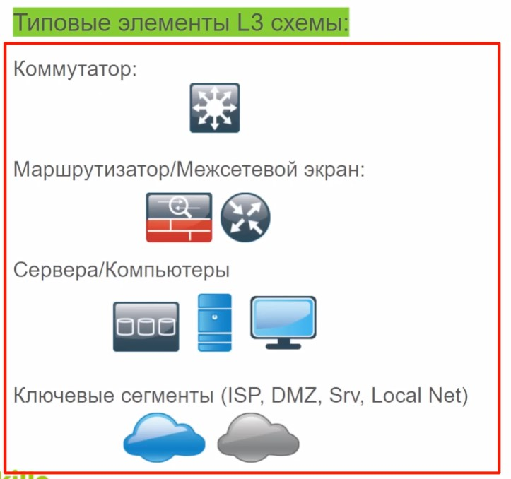
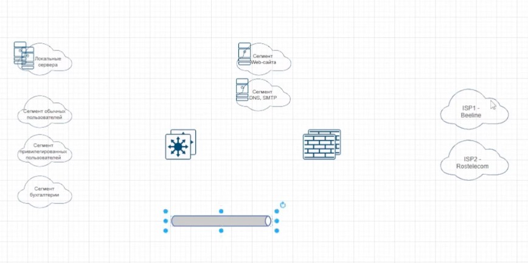
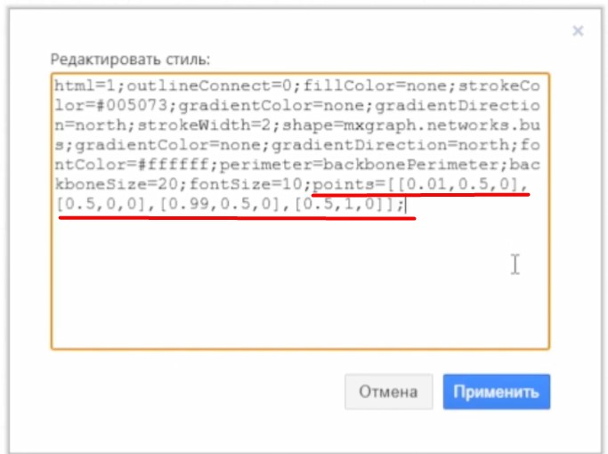
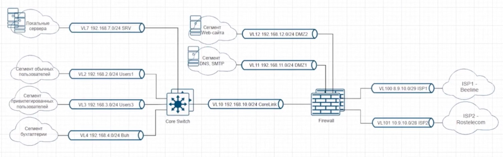
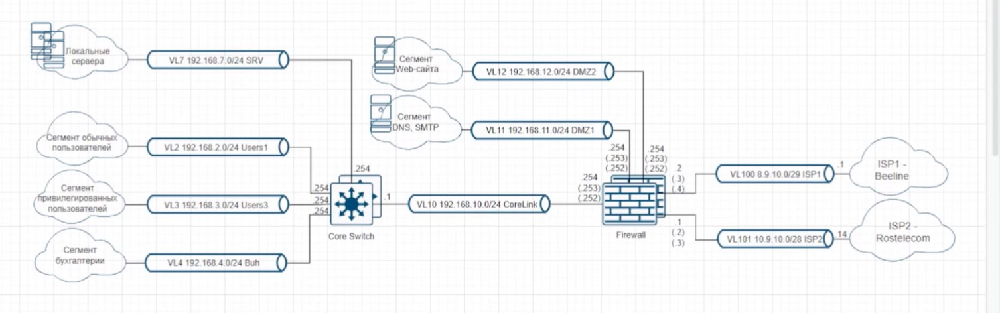

# L3 схема сети

Должна включать VLAN, их номера, логические (ip) адреса  ключевых устройств
- Сегменты сети
- Маршрутизирующие узлы
- Ключевые устройства

Не отражает:
- Физические порты
- Оборудование, которое работает на L2

Объекты соединяют между собой "сетями". 

У сетей надо добавить "точки прявязки", через редактирование стиля.

Такие "трубочки" (подсетки) нарезаем для всех сегментов/VLAN. В результате получаем:

Не забываем добавлять ip IF устройств

