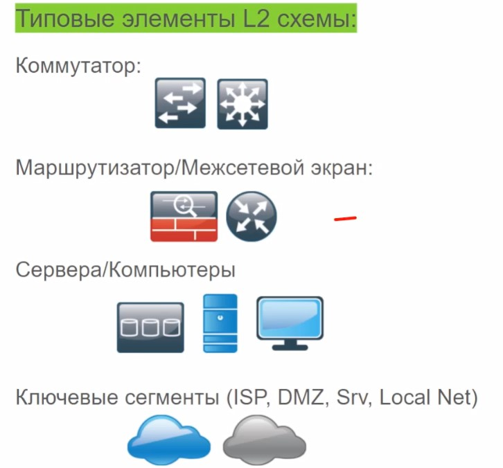

# L2 схема сети

Должна включать VLAN, их номера, логические (ip) адреса  ключевых устройств
- Ключевые коммутационные узлы
- ключевые маршрутизирующие узлы
- VLAN-ы и физические порты
- Ключевые устройства (сервера, АРМ админов)

Не отражает:
- ip-адреса
- виртуальные сети (vrf, vsx, vdom, vswitch и т.д.)

ыва

