# L3 схема сети и ip-план

Должна включать VLAN, их номера, логические (ip) адреса  ключевых устройств
- Сегменты сети
- Маршрутизирующие узлы
- Ключевые устройства

Не отражает:
- Физические порты
- Оборудование, которое работает на L2

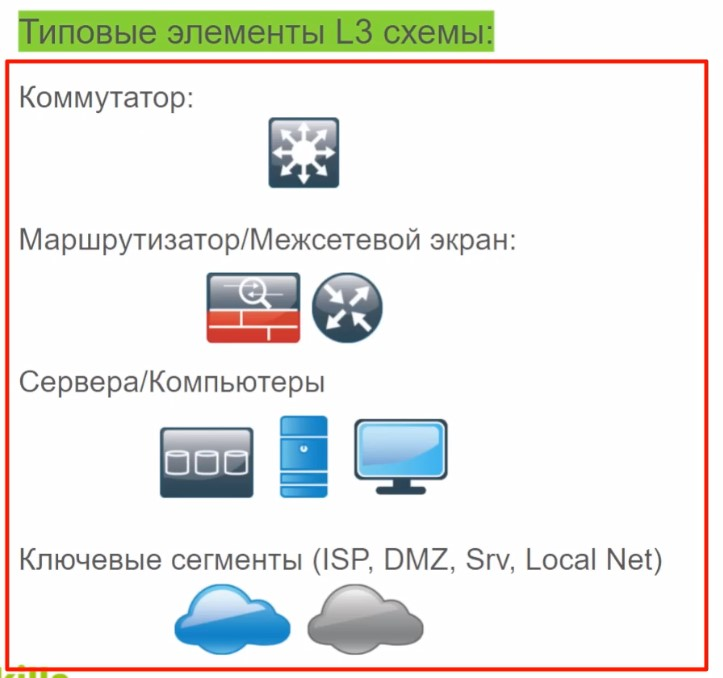

Объекты соединяют между собой "сетями". 

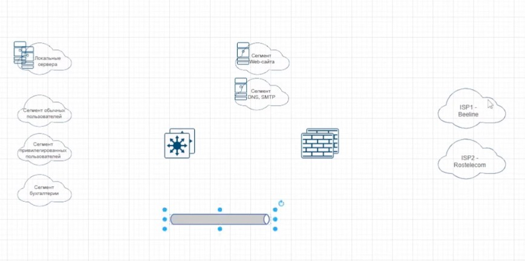

У сетей надо добавить "точки прявязки", через редактирование стиля.

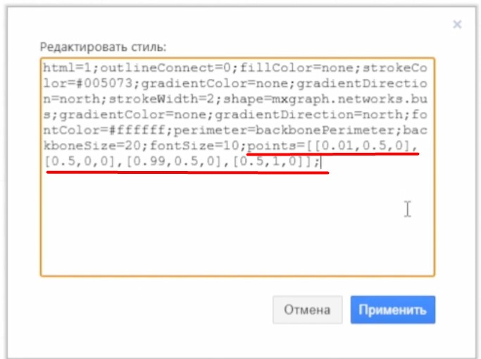

Такие "трубочки" (подсетки) нарезаем для всех сегментов/VLAN. В результате получаем:

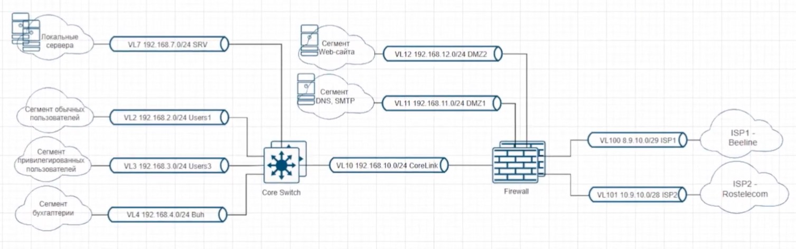

Не забываем добавлять ip IF устройств

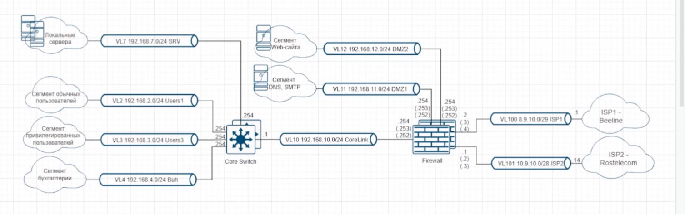

# IP-план
Все эти адресные пространства должны быть заранее спроектированы и занесены в отдельный Excel-файл. Не забываем про выделенный MGMT - сегмент. Для DMZ -  свой MGMT-сегмент

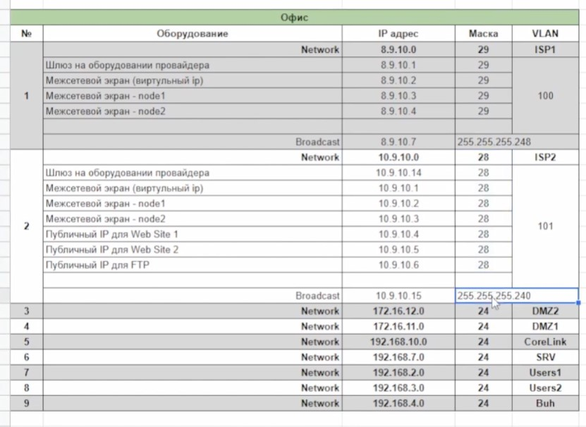

При добавлении VLAN в Excel не забываем добавлять его на L3 - схему, а также на L2-схему в соответствующие EthCh - порты

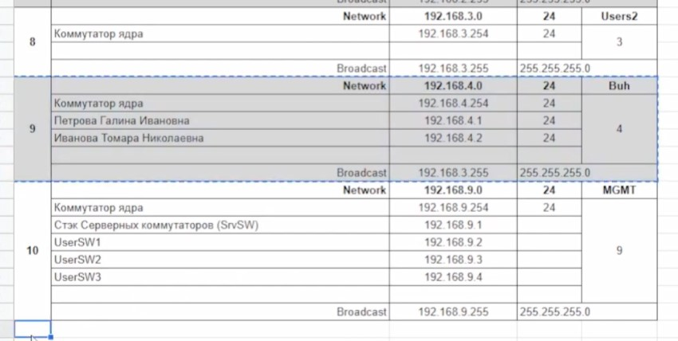

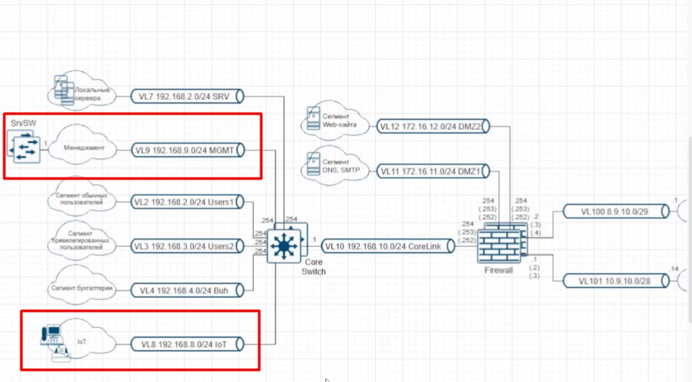

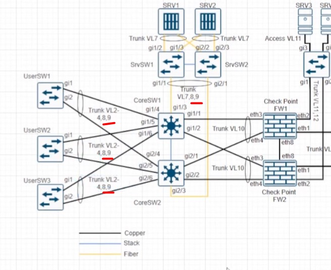

Еще раз: для DMZ -  свой MGMT-сегмент

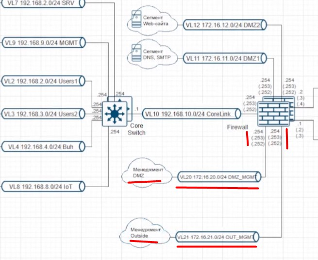

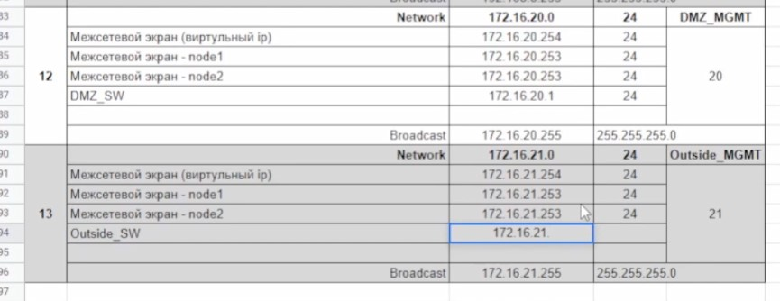

и тогда логично выглядит размещение небольшого числа ключевых устройств в сегментах, внешних относительно LAN. При этом не забываем новые VLAN прописывать в соответствующих транках

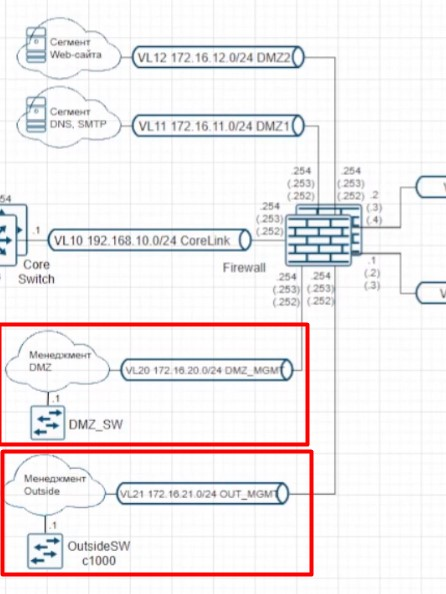

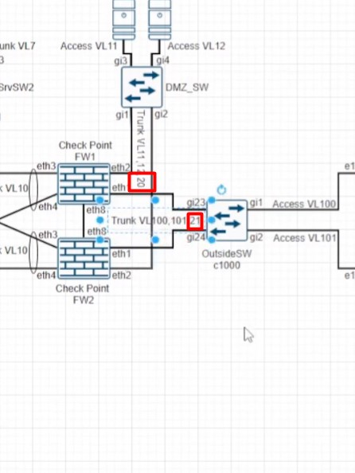

