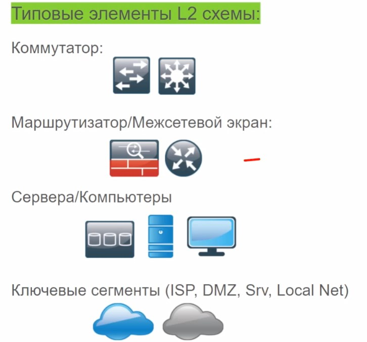
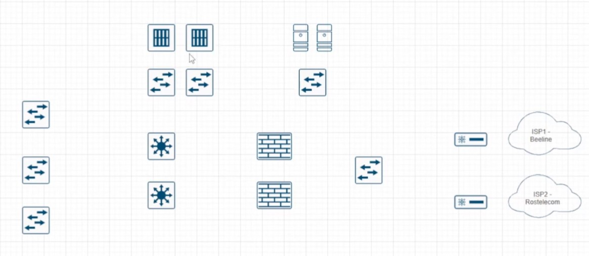
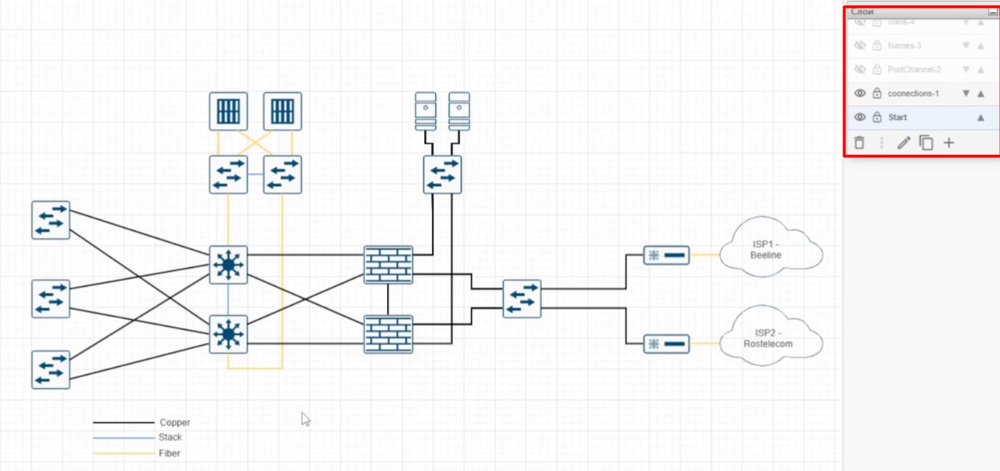
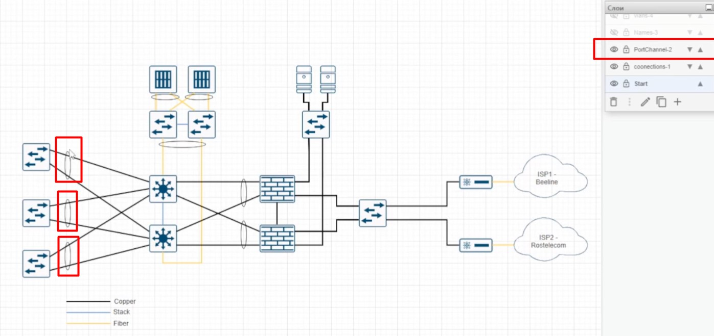
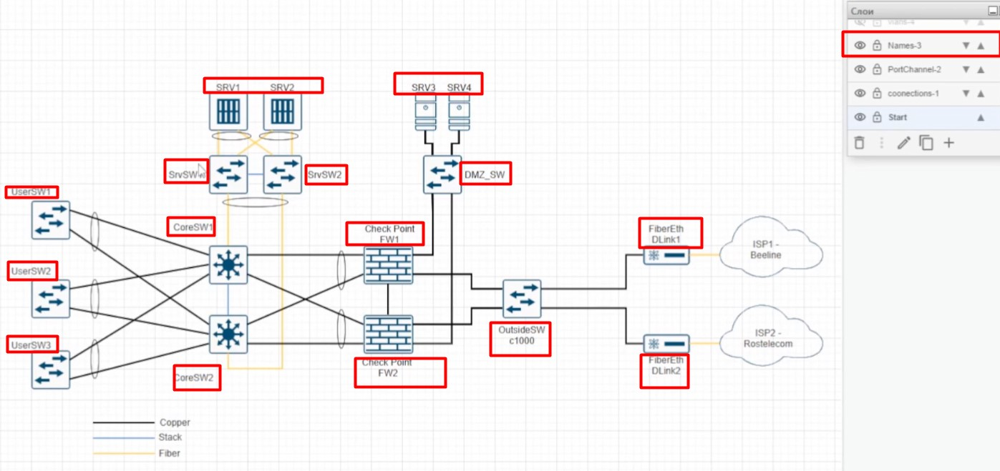
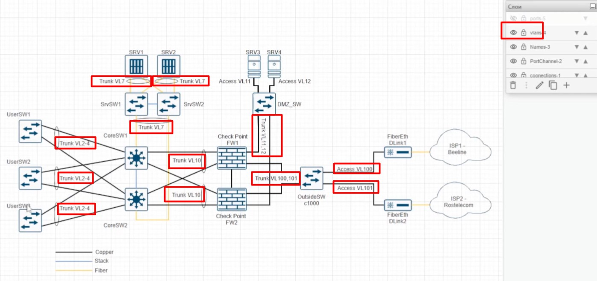
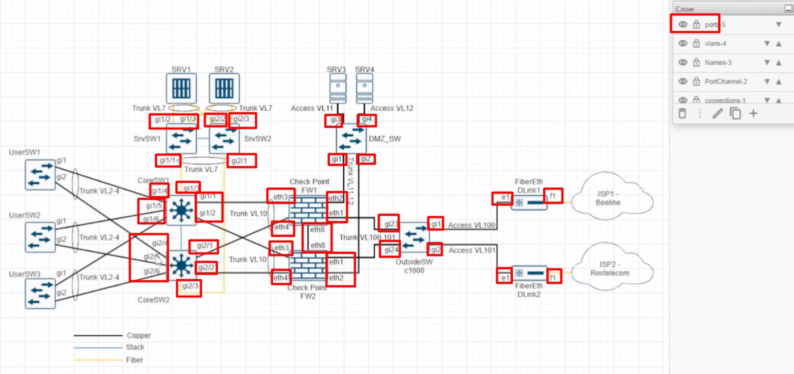

# L2 схема сети

Должна включать VLAN, их номера, логические (ip) адреса  ключевых устройств
- Ключевые коммутационные узлы
- ключевые маршрутизирующие узлы
- VLAN-ы и физические порты
- Ключевые устройства (сервера, АРМ админов)

Не отражает:
- ip-адреса
- виртуальные сети (vrf, vsx, vdom, vswitch и т.д.)

На L2 схеме кластеры уже отображаются 2 устройствами, так как необходимо показать как именно они соединены между собой. 

Также отражают медиаконвертеры/SFP-модули, которые используются для преобразования сред. На этой схеме уже надо использовать "слои", чтобы легко различать:

- типы сред

- типы линков (eth Channel)

- имена нод

- VLAN

- порты

