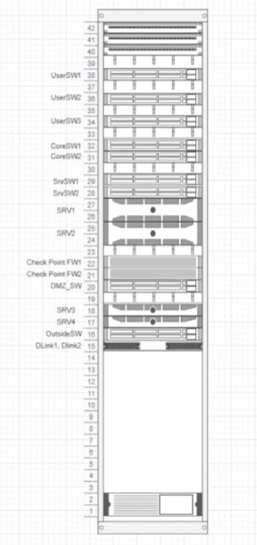

# Расположение оборудования встойке

Необходимо показывать
- Все сетевое оборудование
- Сервера
- Кабельные органайзеры
- Патч-панели
- UPS
- Блоки розеток
- KVM/моник/клаву

Необходимо для:
- порядок
- планирование будущих работ

